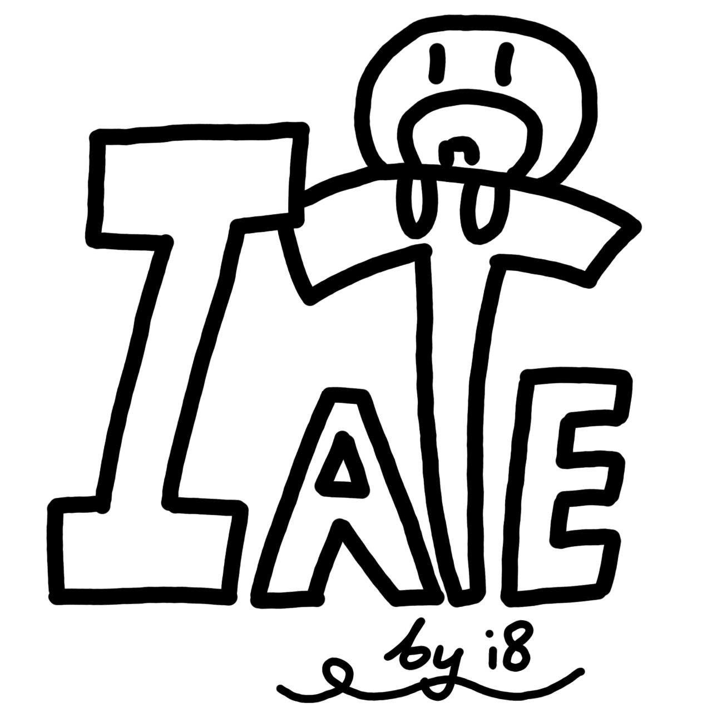

# I ATE - an AI-powered food assistance
### This project was made by Team I8 (_get it?_) for the 25' June Conference Intermediate Hackathon.
> I ATE is an AI-power mobile application that supports individuals with dietary restrictions in accessing suitable foods while maintaining a nutritionally balanced diet.

## Table of Contents
* [General Info](#general-information)
* [Technologies Used](#technologies-used)
* [Features](#features)
* [Screenshots](#screenshots)
* [Development Process](#development-process)
* [Room for Improvement](#room-for-improvement)
* [Acknowledgements](#acknowledgements)

## General Information
I ATE is a project designed to support individuals with dietary restrictions arising from various causes such as chronic illnesses, physical conditions, allergies, and more. With approximately 1 in 3 Singaporeans requiring dietary or lifestyle modifications, I ATE aims to simplify and support this different way of life.

FoodFriend is an AI-powered mobile application that features a personalised meal planner, AI chatbot, and a large food database to cater the varying needs of users.

## Technologies Used
- Python - 3.13.2 64-bit
- Gemini - Gemini 2.0 Flash
- Javascript
- HTML
- CSS
- ChatGPT - 3.5 & 4.0
- 

## Features
- Personalisation of app (input of dietary restrictions and preferences)
- AI-powered weekly meal planner
- Database of food and nutritional value
- FoodFriend AI Chatbot

## Screenshots

## Development Process
10th June 2025
- Experimented with Gemini API
- Built backbone of website with HTML and CSS
- Discussion of features to be implemented
- Explored libraries (e.g. pocketsphinx, vosk, google generative ai)
- Began on presentation slides and script for BuildingBloCS Hackathon

11th June 2025
- Continuation of creating presentation slides and script
- Coded Gemini in Python and engineered input prompts and system instructions to customise AI for food advice
- Coded Gemini for weekly meal planner
- Continuation of website building with HTML and CSS

12th June 2025
- Javascript for template of large food database

13th June 2025
- Presentation rehearsal
- Integrated Gemini into website (Both chatbot and meal planner)
- a lot of confusion
- UI/UX design of mobile app

14th June 2025
  - Presentation to judges

## Room for Improvement
- Personalisation page
- Multilingual UI
- Voice-powered AI (speech-to-text with vosk)
- Image recognition of food items (ChatGPT)

## Acknowledgements
- This project was inspired by our conference group name 'i8' (a homophone of 'I ATE')
- Many thanks to...
  - [https://buildingblocs.sg/] for very helpful coding and AI workshops
  - [https://bulldogjob.com/readme/how-to-write-a-good-readme-for-your-github-project] for the README.md reference
  - [https://chatgpt.com/?model=gpt-4o] for large food database
  - [https://www.ncbi.nlm.nih.gov/] for research of prevalence of dietary restrictions
